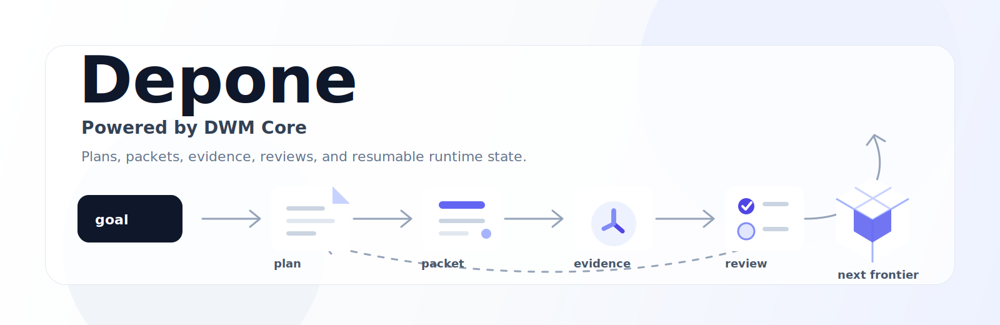

# Depone

> Non-executing verifier and evidence-contract source of truth for Superflow.

[](LICENSE)
[](https://github.com/Moonweave-Systems/Depone/releases)
[](docs/command-reference.md)



**Depone** is the verifier engine inside Superflow, published under the
Moonweave account. It re-derives A0/A1/A2, blocked, or refuted from signed
evidence bytes, offline, and cannot raise the grade beyond what those bytes
support.

Depone verifies; witnessd executes; Superflow exposes the workflow.

The source of truth for this repository is [`docs/spec.md`](docs/spec.md).
README, agent context files, skill text, command references, release notes, and
historical DWM documents are derived or compatibility documents. If they conflict
with `docs/spec.md`, the spec wins. For the documentation map, see
[`docs/README.md`](docs/README.md).

## Product boundary

Depone owns the evidence contract for capture manifests, observer captures,
isolation facts, runner receipts, DSSE envelopes, evidence contracts, schedules,
team ledgers, policies, verification recipes, MCP/tool receipts, and verifier
error codes. Runtimes such as [`witnessd`](https://github.com/Moonweave-Systems/witnessd)
execute work and emit evidence; Depone re-derives the verdict from those bytes.

| Public surface | User intent | Depone role |
| --- | --- | --- |
| `superflow` | scout -> plan -> run -> evidence -> verifier summary -> handoff | re-derive after witnessd emits bytes |
| `superflow scout` | read-only repo exploration | verify bound planning artifacts only |
| `flowplan` | plan-only workflow design | validate plan/contract gates |
| `proofrun` | evidence-backed execution alias | verify emitted evidence when requested |
| `proofcheck` | offline evidence verification | primary public verifier alias |
| `superflow handoff` | maintainer review package | validate evidence links, not approval |
| `superflow auto` | continuation behind evidence gates | revalidate and gate next action |
| `superflow ultra` | future high-autonomy profile | same verifier rules, stricter policies |

Direct `depone` CLI and `SKILL.md` usage remain developer, verifier, CI, and
compatibility surfaces. They are not the final flagship user UX beside a separate
`witnessd` skill.

## Repository and install boundary

The engines remain separate repositories:

```text
Depone   = verifier engine and evidence contract
witnessd = execution engine and evidence emitter
```

The user-facing install should still be one product: Superflow. Normal users
should not be told to install separate Depone and witnessd skills for one
workflow. In the near term, the thin `superflow` command/skill may live in the
witnessd repo because Superflow starts execution and witnessd owns execution.
Depone is consumed as a pinned verifier dependency.

A future standalone `Superflow` repo is only for distribution: marketplace
manifests, host-specific plugin bundles, examples, product docs, version locks,
and end-to-end integration tests. It is not a third engine and must not duplicate
Depone verifier logic or witnessd runtime logic.

## Quickstart

```bash
# Installation from source. PyPI publishing is not active yet.
git clone https://github.com/Moonweave-Systems/Depone
cd Depone
python -m pip install --no-deps .

# Check the package-local verifier surface.
depone doctor --json

# Re-derive committed evidence/verifier fixtures.
depone evidence-ingest --self-test
depone evidence-chain --self-test
depone team-ledger --self-test
```

Source installation smoke is:

```bash
python scripts/install_smoke.py --json
```

It installs Depone from the local source tree with `--no-deps`, runs the
installed `depone doctor`, and re-validates a committed team-ledger artifact. It
does not publish a package or claim PyPI readiness.

## What exists today

Depone ships a stdlib verifier package, strict plan/contract validators,
evidence adapters, DSSE/in-toto-shaped substrate helpers, and offline gates for
agent-session evidence. It can re-derive assurance from:

- capture manifests and observer captures,
- runner receipts and local capability receipts,
- isolation facts,
- signed evidence bundles,
- evidence-contract artifacts,
- schedule/team-ledger artifacts,
- verification recipes and receipts,
- repo-profile/context-pack bindings,
- skillpack-lock hashes,
- MCP/tool receipts,
- PR handoff evidence.

It cannot turn a weak capture into a stronger one. If the bytes only support A0,
the verifier must report A0. If observer capture or isolation evidence is
missing, the verifier must not infer it from prose, model claims, skill text, MCP
output, or operator intent.

## Command taxonomy

| Class | Examples | Product meaning |
| --- | --- | --- |
| Verifier commands | `evidence-ingest`, `evidence-chain`, `team-ledger` | Stable engine calls for `proofcheck`. |
| Contract commands | `validate`, `compile`, evidence-contract validation | Planning/contract helpers for `flowplan`. |
| Gate commands | `next`, `team-launch-preflight` | Non-executing gates for wrapper workflows. |
| Compatibility/demo commands | `demo`, `observe`, `evidence-substrate`, internal `agent-fabric-*` surfaces | Useful for fixtures and development, not the final user surface. |

Commands that launch workers, own sessions, retry, call external MCP/tools, or
mutate active worktrees belong in witnessd or in the future Superflow wrapper
calling witnessd. Commands that consume bytes and emit verifier results belong in
Depone.

## Normal Superflow loop

```text
1. Superflow receives the user goal.
2. Superflow scouts repo context when useful.
3. witnessd executes work and emits evidence bytes.
4. Depone reads the artifact bytes offline.
5. Depone re-derives the verdict and assurance grade.
6. Superflow summarizes and prepares handoff without upgrading the verdict.
```

For direct verifier use, steps 1, 2, 3, and 6 are skipped: `proofcheck` or
`depone` reads existing evidence and reports what the bytes support.

## Quality

Release readiness is checked with:

```bash
python3 -m unittest discover -s tests -p 'test_*.py'
python3 -m depone validate-contracts --self-test
python3 -m depone doctor --self-test
python scripts/check_readme_quality.py README.md
```

## Documentation

- [`docs/spec.md`](docs/spec.md) — authoritative Depone repository spec.
- [`docs/README.md`](docs/README.md) — documentation map and legacy policy.
- [`docs/command-reference.md`](docs/command-reference.md) — command inventory and compatibility reference.
- [`references/workflow-plan-schema.md`](references/workflow-plan-schema.md) and [`SKILL.md`](SKILL.md) — compatibility planning and skill surfaces derived from the spec.

## License

MIT. See [`LICENSE`](LICENSE).
